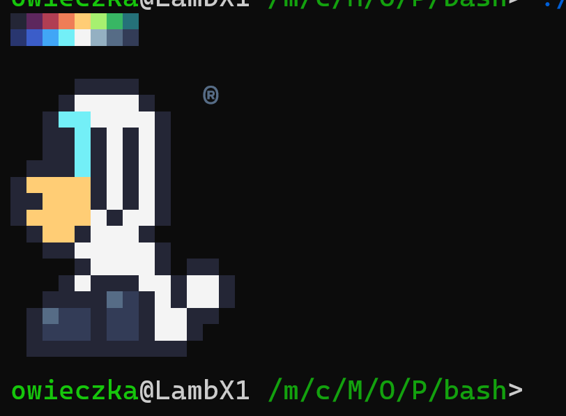
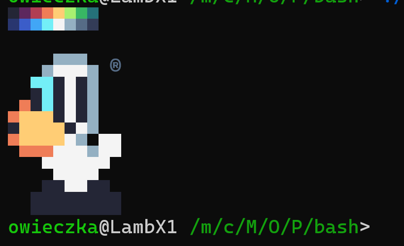

# Wecome
My config files and tools for linux environment

## Terminal Logo

It is nice to have some personal terminal logo welcome screen. Mine is simple Little Lamb image. 

  

I have put mine personal logo in two small bash scripts [`lamb20.sh`](terminal-logo/lamb20.sh) and [`lamb16.sh`](terminal-logo/lamb16.sh) I'm using excellent [sweetie-16](https://lospec.com/palette-list/sweetie-16) pallete by [GrafxKid](http://grafxkid.tumblr.com/palettes).

